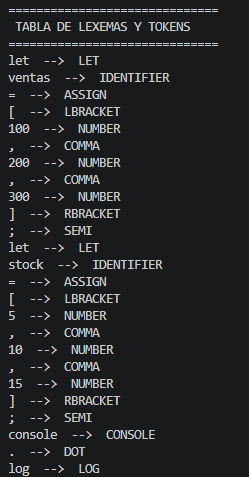
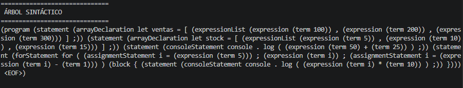
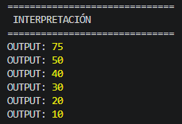
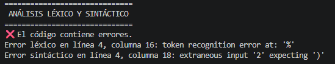

# Analizador MiniJS

## Descripción

Este proyecto implementa un analizador léxico, sintáctico e intérprete básico utilizando ANTLR4 y JavaScript.

El sistema procesa una versión reducida del lenguaje JavaScript definida mediante una gramática propia (`MiniJS.g4`).

El objetivo principal del proyecto es simular el funcionamiento básico de un compilador/intérprete, permitiendo analizar código fuente, detectar errores y ejecutar instrucciones simples del lenguaje MiniJS.

# Autor

- Nombre: Valentina Martinez Filipczyk  
- Legajo: 53420

# Funcionalidades Soportadas

El lenguaje MiniJS soporta:

- declaración de variables
- operaciones aritméticas
- impresión por consola (`console.log`)
- estructuras repetitivas `for`
- arreglos
- expresiones matemáticas
- manejo básico de errores léxicos y sintácticos

# Estructura del Proyecto

```txt
ANALIZADOR/
├── generated/
├── imagenes/
├── index.js
├── Interpreter.js
├── MiniJS.g4
├── MiniJSLexer.js
├── MiniJSParser.js
├── MiniJSVisitor.js
├── input_correcto1.txt
├── input_correcto2.txt
├── input_incorrecto1.txt
├── input_incorrecto2.txt
├── package.json
├── package-lock.json
└── README.md
```

# Instalación

Instalar dependencias:

```bash
npm install
```

# Generación del Parser y Lexer

Ejecutar:

```bash
npm run build
```

Este comando genera automáticamente los archivos correspondientes al lexer y parser a partir de la gramática `MiniJS.g4`.

# Ejecución del Analizador

Ejecutar:

```bash
npm start
```

# Etapas del Análisis

## Análisis Léxico

El lexer se encarga de convertir los caracteres del programa fuente en tokens reconocibles.

El sistema reconoce:

- identificadores
- números
- operadores
- palabras reservadas
- símbolos especiales

Además genera una tabla de lexemas y tokens.



# Análisis Sintáctico

El parser verifica que el programa cumpla correctamente la estructura definida en la gramática `MiniJS.g4`.

Además construye el árbol sintáctico concreto de la entrada.



# Interpretación

El intérprete ejecuta instrucciones válidas del lenguaje MiniJS.

Entre las funcionalidades implementadas se encuentran:

- `console.log`
- operaciones matemáticas
- estructuras `for`
- manejo de arreglos



# Manejo de Errores

El sistema detecta errores léxicos y sintácticos mostrando mensajes descriptivos para facilitar la identificación del problema.



# Ejemplos Incluidos

El proyecto incluye ejemplos de entrada correctos e incorrectos.

## Inputs Correctos

- `input_correcto1.txt`
- `input_correcto2.txt`

## Inputs Incorrectos

- `input_incorrecto1.txt`
- `input_incorrecto2.txt`

# Tecnologías Utilizadas

- JavaScript
- Node.js
- ANTLR4
- Visual Studio Code
- Git y GitHub